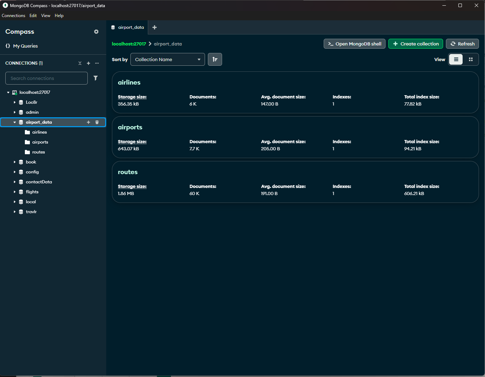
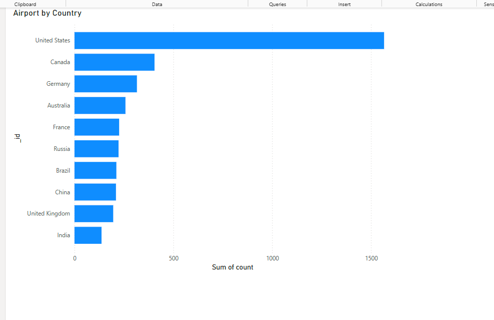
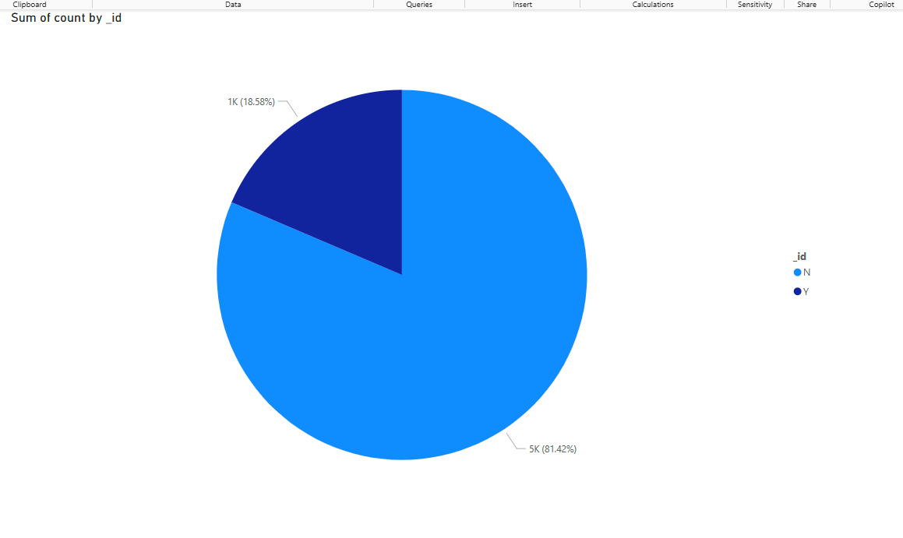
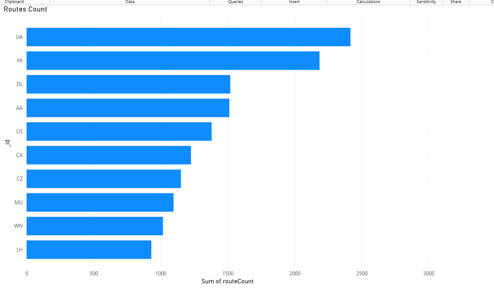
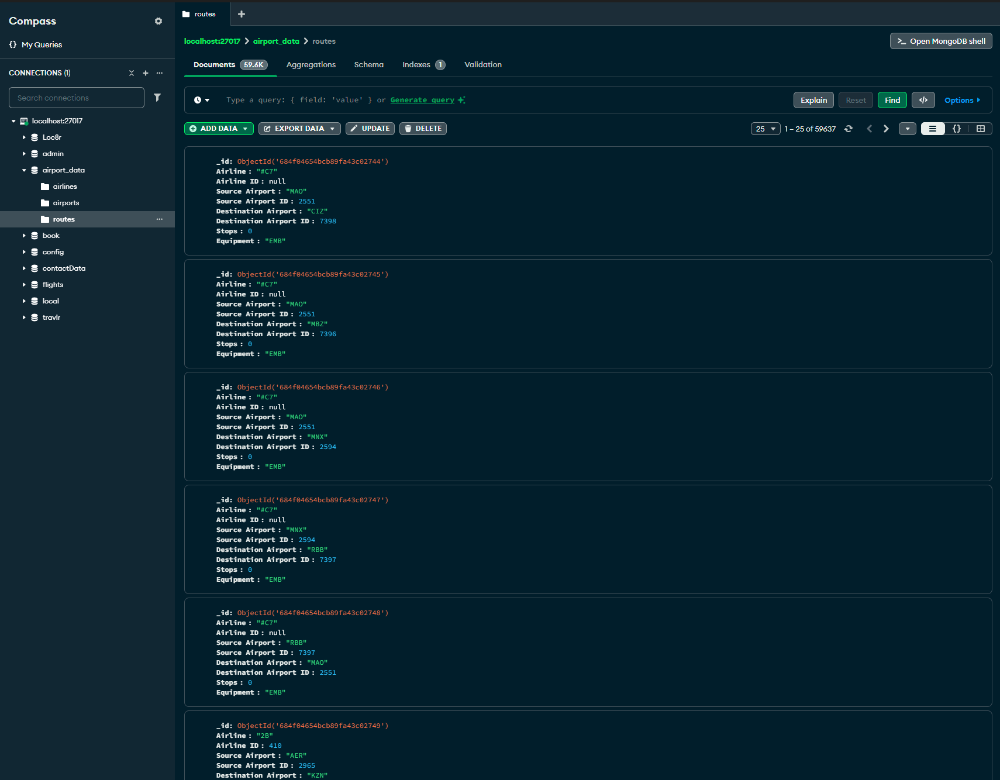
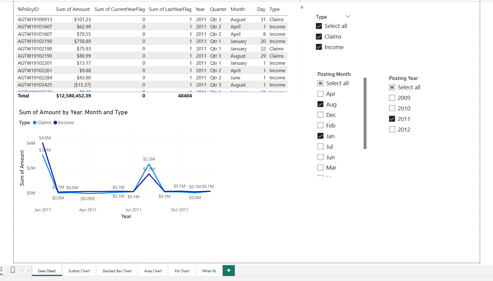
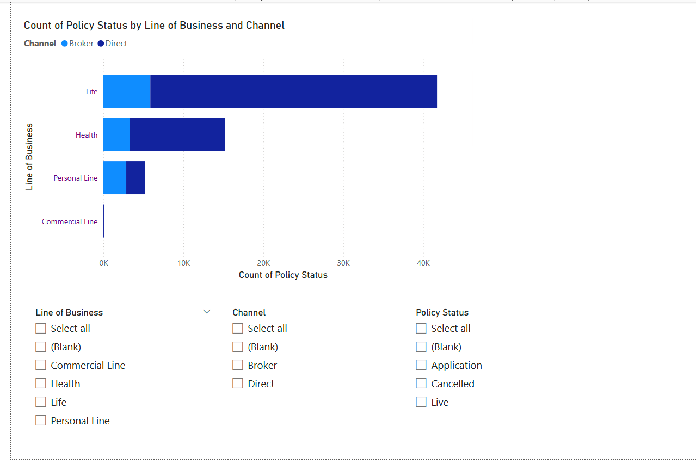
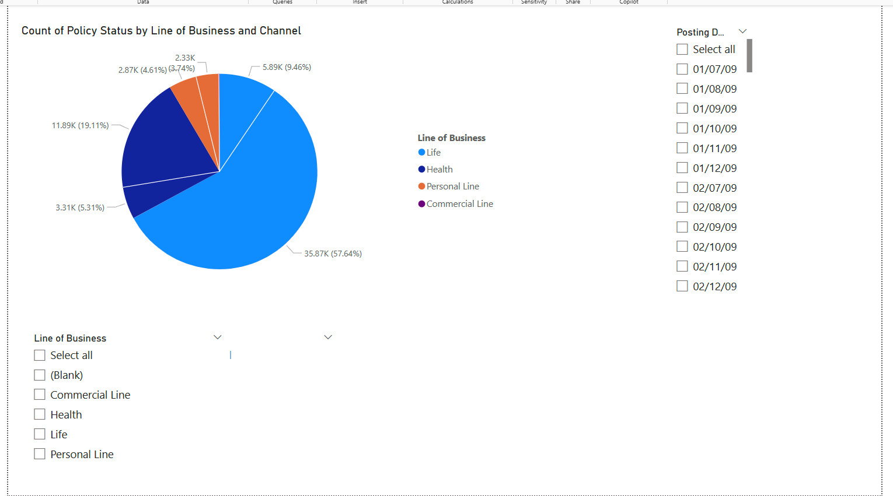

# 📸 Artifact 3 – Power BI Dashboard Screenshots

This folder contains key visualizations generated as part of **Artifact 3: MongoDB and Power BI Integration**. These visuals were created using global airline, airport, and route data imported into MongoDB and analyzed in Power BI.

---

## ✈️ Airline and Airport Visualizations

### 🛫 Airline Data Overview
[Airline_Data](./Airline_Data.png)

### 🏢 Airport Records Table

### 📊 Airport Bar Chart – Top Airports by Country

### 🥧 Airport Pie Chart – Route Distribution

### 🌐 Airport and Route Relationship

---

## 📊 Route Visualizations

### 🗺️ Route Data Table

---

## 🧾 Original Insurance Data Dashboards

These charts represent the original dataset used before enhancement with MongoDB and airline datasets.

### 📊 Insurance Table Overview

### 📈 Insurance Bar Chart

### 🥧 Insurance Pie Chart

